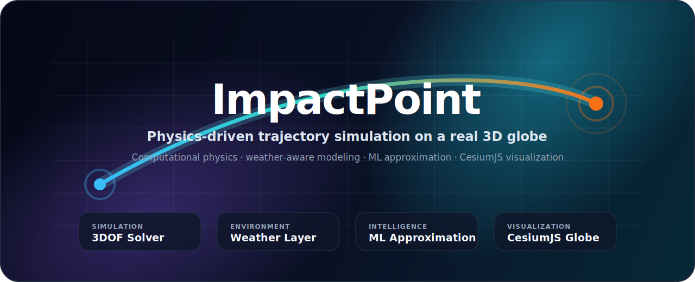

<div align="center">
<<<<<<< HEAD

# ImpactPoint

### Physics-Driven Trajectory Simulation & 3D Visualization Platform

<p align="center">
  A full-stack, weather-aware projectile simulation platform combining <b>computational physics</b>, <b>machine learning</b>, and <b>interactive 3D visualization</b>.
</p>

<p align="center">
  <a href="https://github.com/YardenNitsan/impact-point-project">
    
  </a>
  
  
  
  
  
  
  
</p>

<p align="center">
  
  
  
  
</p>

=======



<br />

<h3>Physics-Driven Trajectory Simulation & 3D Visualization Platform</h3>

<p>
  <b>ImpactPoint</b> is a full-stack simulation platform for modeling, analyzing, and visualizing projectile trajectories in a realistic 3D geographic environment.
</p>

<p>
  <a href="#quick-start"><b>Quick Start</b></a>
  ·
  <a href="#system-architecture"><b>Architecture</b></a>
  ·
  <a href="#application-urls"><b>Application URLs</b></a>
  ·
  <a href="#manual-development-mode"><b>Manual Setup</b></a>
  ·
  <a href="#troubleshooting"><b>Troubleshooting</b></a>
</p>

<p>
  
  
  
  
  
</p>

>>>>>>> 0cd6e79 (modified readme)
</div>

---

## Overview

<<<<<<< HEAD
**ImpactPoint** is a full-stack simulation platform for modeling, analyzing, and visualizing projectile trajectories in a realistic 3D geographic environment.

The system combines:

- **Computational physics**
- **Numerical simulation**
- **Atmospheric and weather-aware modeling**
- **Machine learning-based environmental approximation**
- **Microservice architecture**
- **Interactive 3D visualization with CesiumJS**

It allows a user to define launch parameters from a real-world location, run a physics-driven trajectory simulation, and inspect the resulting path and impact point on an interactive 3D globe.

---

## Why ImpactPoint?

ImpactPoint was designed to bridge the gap between:

- **theoretical projectile motion**
- **real environmental influence**
- **high-performance computation**
- **user-friendly visual exploration**

Instead of relying on a simple vacuum/parabolic model, the system integrates atmospheric and weather-related factors such as temperature, pressure, and wind into the simulation pipeline, producing results that are significantly more realistic.

---

## Key Highlights

<table>
  <tr>
    <td width="50%">
      <h3>Physics-Based Simulation</h3>
      <ul>
        <li>3DOF projectile dynamics</li>
        <li>Gravity and drag modeling</li>
        <li>Numerical timestep integration</li>
        <li>Terrain-aware impact detection</li>
      </ul>
    </td>
    <td width="50%">
      <h3>Weather-Aware Pipeline</h3>
      <ul>
        <li>Temperature integration</li>
        <li>Pressure integration</li>
        <li>Wind component handling</li>
        <li>Atmospheric influence on trajectory</li>
=======
**ImpactPoint** is an end-to-end projectile simulation system that combines **computational physics**, **weather-aware modeling**, **machine learning**, and **interactive 3D visualization**.

The system allows a user to define launch parameters, run a physics-based trajectory simulation, and visualize the resulting path and impact point on a real 3D globe.

Unlike a simplified textbook projectile model, ImpactPoint considers real-world environmental effects such as atmospheric conditions, pressure, temperature, wind, and terrain-aware impact behavior.

---

## Product Highlights

<table>
  <tr>
    <td width="50%">
      <h3>Physics Engine</h3>
      <p>
        A Python/FastAPI simulation engine that models projectile motion using a 3 Degree of Freedom trajectory solver.
      </p>
      <ul>
        <li>Gravity-based motion</li>
        <li>Aerodynamic drag</li>
        <li>Atmospheric density influence</li>
        <li>Numerical timestep integration</li>
      </ul>
    </td>
    <td width="50%">
      <h3>Weather-Aware Modeling</h3>
      <p>
        Environmental values are resolved during simulation to make the trajectory more realistic than a simple vacuum model.
      </p>
      <ul>
        <li>Temperature</li>
        <li>Pressure</li>
        <li>Wind components</li>
        <li>Altitude-related context</li>
>>>>>>> 0cd6e79 (modified readme)
      </ul>
    </td>
  </tr>
  <tr>
    <td width="50%">
<<<<<<< HEAD
      <h3>Machine Learning Support</h3>
      <ul>
        <li>Fast environmental approximation</li>
        <li>Reduced dependency on repeated weather queries</li>
        <li>Improved runtime efficiency</li>
      </ul>
    </td>
    <td width="50%">
      <h3>Interactive 3D Visualization</h3>
      <ul>
        <li>Built with Angular + CesiumJS</li>
        <li>Real-world geographic visualization</li>
        <li>Trajectory rendering on a 3D globe</li>
        <li>Impact point inspection</li>
=======
      <h3>Machine Learning Layer</h3>
      <p>
        A dedicated ML service provides fast environmental approximation and reduces dependency on repeated expensive data lookups.
      </p>
      <ul>
        <li>Weather-related prediction service</li>
        <li>Fast runtime inference</li>
        <li>Designed for service-based integration</li>
      </ul>
    </td>
    <td width="50%">
      <h3>3D Visualization</h3>
      <p>
        The Angular + CesiumJS frontend visualizes the simulated trajectory in a real geographic environment.
      </p>
      <ul>
        <li>Interactive 3D globe</li>
        <li>Trajectory rendering</li>
        <li>Impact point visualization</li>
        <li>Camera navigation and spatial inspection</li>
>>>>>>> 0cd6e79 (modified readme)
      </ul>
    </td>
  </tr>
</table>
<<<<<<< HEAD

---

## Core Features

### 1. Physics-Based Trajectory Solver

The core simulation engine is implemented in **Python** and models projectile flight using a **3 Degree of Freedom (3DOF)** ballistic solver.

The solver includes:

- Gravity-based motion
- Aerodynamic drag
- Atmospheric density effects
- Temperature and pressure influence
- Wind influence along the trajectory
- Numerical integration over time
- Terrain-aware impact detection
- Full trajectory generation for visualization

The internal simulation may generate a large number of points, while the rendered output can be sampled to remain efficient for frontend visualization.

---

### 2. Weather & Environmental Integration

ImpactPoint includes a dedicated **Weather Service** responsible for resolving environmental values needed by the physics engine.

These include:

- Temperature
- Pressure
- Wind components
- Altitude-related environmental context

This allows the simulation to reflect real atmospheric influence rather than behaving like a simplified textbook-only projectile model.

---

### 3. Machine Learning-Based Approximation

A dedicated **ML Service** helps approximate weather-related values used during the simulation pipeline.

This improves runtime efficiency by reducing the need for expensive repeated environmental lookups while still maintaining meaningful physical behavior.

---

### 4. 3D Geographic Visualization

The frontend is built with **Angular** and **CesiumJS**, allowing the user to:

- Define launch conditions
- Trigger simulations
- View the resulting trajectory
- Inspect the impact point
- Navigate an interactive 3D globe
- Visualize projectile behavior in a realistic environment

---

## System Architecture

ImpactPoint follows a **microservice-based architecture**.

### High-Level Flow

```text
User
 │
 ▼
Frontend (Angular + CesiumJS)
 │
 ▼
Main API Service (Node.js / Express)
 │
 ▼
Algorithm Service (Python / FastAPI Physics Engine)
 │
 ▼
Weather Service (Python / FastAPI)
 │
 ▼
ML Weather Service (Python / FastAPI)
```

### Architecture Diagram

```mermaid
flowchart TD
    A[Frontend<br/>Angular + CesiumJS] --> B[Main API Service<br/>Node.js + Express]
    B --> C[Algorithm Service<br/>Python + FastAPI]
    C --> D[Weather Service<br/>Python + FastAPI]
    D --> E[ML Weather Service<br/>Python + FastAPI]
    B --> F[(MongoDB)]
=======

---

## What the System Does

ImpactPoint receives launch and simulation parameters from the frontend, sends them through the backend orchestration layer, runs a physics-based trajectory simulation, resolves environmental data, and returns a trajectory that can be rendered in the browser.

The system is designed to demonstrate a complete software engineering workflow:

- clean service separation
- API-driven communication
- containerized deployment
- scientific simulation
- machine-learning-assisted runtime behavior
- user-facing 3D visualization

---

## System Architecture

ImpactPoint is built as a microservice-based system.

```mermaid
flowchart TD
    A["Frontend<br/>Angular + CesiumJS"] --> B["Main API Service<br/>Node.js + Express"]
    B --> C["Algorithm Service<br/>Python + FastAPI"]
    C --> D["Weather Service<br/>Python + FastAPI"]
    D --> E["ML Weather Service<br/>Python + FastAPI"]
    B --> F[("MongoDB")]
```

### Runtime Flow

```text
User
 │
 ▼
Frontend
 │
 ▼
Main API Service
 │
 ▼
Algorithm / Physics Service
 │
 ▼
Weather Service
 │
 ▼
ML Weather Service
>>>>>>> 0cd6e79 (modified readme)
```

---

## Technology Stack

| Layer | Technology |
|---|---|
| Frontend | Angular, TypeScript, CesiumJS |
<<<<<<< HEAD
| Backend API | Node.js, Express |
| Physics / Simulation | Python, FastAPI, NumPy |
| ML Layer | Python, FastAPI, ML model artifacts |
| Database | MongoDB |
| Containerization | Docker, Docker Compose |
=======
| API Orchestration | Node.js, Express |
| Physics Simulation | Python, FastAPI, NumPy |
| Weather Layer | Python, FastAPI |
| Machine Learning Layer | Python, FastAPI, ML model artifacts |
| Database | MongoDB |
| Deployment | Docker, Docker Compose |
>>>>>>> 0cd6e79 (modified readme)

---

## Service Responsibilities

<<<<<<< HEAD
| Service | Technology | Responsibility |
|---|---|---|
| **Frontend** | Angular + CesiumJS | User interface and 3D globe visualization |
| **Main Service** | Node.js + Express | Main API layer and orchestration |
| **Algorithm Service** | Python + FastAPI | Physics-based 3DOF trajectory simulation |
| **Weather Service** | Python + FastAPI | Weather and atmospheric data layer |
| **ML Weather Service** | Python + FastAPI | Fast approximation of environmental values |
| **MongoDB** | MongoDB | Persistent storage |
=======
| Service | Main Role |
|---|---|
| **Frontend** | Provides the user interface and renders the trajectory on a 3D globe |
| **Main Service** | Coordinates requests between the frontend, simulation engine, and database |
| **Algorithm Service** | Runs the 3DOF physics simulation and generates trajectory data |
| **Weather Service** | Supplies atmospheric and environmental values required by the simulation |
| **ML Weather Service** | Provides fast machine-learning-based approximation of environmental values |
| **MongoDB** | Stores simulation-related data and backend persistence data |
>>>>>>> 0cd6e79 (modified readme)

---

## Repository Structure

```text
impact-point-project/
│
├── frontend/
│   └── Angular + CesiumJS visualization client
│
├── services/
│   ├── main-service/
│   │   └── Node.js / Express orchestration service
│   │
│   ├── algorithm_service/
│   │   └── Python / FastAPI physics simulation engine
│   │
│   ├── weather_service/
<<<<<<< HEAD
│   │   └── Python / FastAPI weather/environment service
│   │
│   └── ML_service/
│       └── Python / FastAPI machine learning service
=======
│   │   └── Python / FastAPI weather and environment service
│   │
│   └── ML_service/
│       └── Python / FastAPI machine learning weather service
>>>>>>> 0cd6e79 (modified readme)
│
├── scripts/
│   └── Utility scripts
│
├── attacks_simulations/
<<<<<<< HEAD
│   └── Simulation examples / test data
=======
│   └── Simulation examples and test data
>>>>>>> 0cd6e79 (modified readme)
│
├── docker-compose.yml
├── dev.ps1
├── .gitignore
└── README.md
```

---

## Quick Start

<<<<<<< HEAD
## Prerequisites

For the recommended Docker-based setup, install:

- **Docker Desktop**
- **Docker Compose**

For manual development, install:

- **Node.js**
- **npm**
- **Python**
- **pip**
- **Angular CLI**
- **MongoDB**

---

## Clone the Repository

```bash
git clone https://github.com/YardenNitsan/impact-point-project.git
cd impact-point-project
```

---

## Environment Files

> **Important:** Real `.env` files are not committed to the repository for security reasons.

The Docker Compose setup expects these local files:

```text
services/ML_service/.env
services/weather_service/.env
services/algorithm_service/.env.api
services/algorithm_service/.env.dataset
services/main-service/.env
```

If they do not exist, Docker Compose may fail before startup.

### Create empty env files (Windows PowerShell)

```powershell
New-Item -ItemType File -Force services/ML_service/.env
New-Item -ItemType File -Force services/weather_service/.env
New-Item -ItemType File -Force services/algorithm_service/.env.api
New-Item -ItemType File -Force services/algorithm_service/.env.dataset
New-Item -ItemType File -Force services/main-service/.env
```

### Create empty env files (Linux / macOS / Git Bash)

```bash
touch services/ML_service/.env
touch services/weather_service/.env
touch services/algorithm_service/.env.api
touch services/algorithm_service/.env.dataset
touch services/main-service/.env
```

---

## Running the Project with Docker Compose

Docker Compose is the **recommended** way to run the full system.

### First Run / After Dependency Changes

Use this command the first time you run the project or after dependency / Dockerfile changes:
=======
The recommended way to run the full project is with **Docker Compose**.

### Prerequisites

Install:

- Docker Desktop
- Docker Compose

Then clone the repository:

```bash
git clone https://github.com/YardenNitsan/impact-point-project.git
cd impact-point-project
```

---

## Environment Files

Real environment files are not committed to the public repository for security reasons.

Docker Compose expects these local files to exist:

```text
services/ML_service/.env
services/weather_service/.env
services/algorithm_service/.env.api
services/algorithm_service/.env.dataset
services/main-service/.env
```

Create them before running the project.

### Windows PowerShell

```powershell
New-Item -ItemType File -Force services/ML_service/.env
New-Item -ItemType File -Force services/weather_service/.env
New-Item -ItemType File -Force services/algorithm_service/.env.api
New-Item -ItemType File -Force services/algorithm_service/.env.dataset
New-Item -ItemType File -Force services/main-service/.env
```

### Linux / macOS / Git Bash

```bash
touch services/ML_service/.env
touch services/weather_service/.env
touch services/algorithm_service/.env.api
touch services/algorithm_service/.env.dataset
touch services/main-service/.env
```

> These files are intentionally ignored by Git. Do not commit real secrets, API keys, tokens, passwords, or private credentials.

---

## Running with Docker Compose

### First Run

Use this command the first time you run the system or after dependency/Dockerfile changes:
>>>>>>> 0cd6e79 (modified readme)

```bash
docker compose --profile api up --build
```

<<<<<<< HEAD
### Regular Run

After everything is already built, use:
=======
### Normal Run

After the containers have already been built:
>>>>>>> 0cd6e79 (modified readme)

```bash
docker compose --profile api up
```

<<<<<<< HEAD
This starts the main application profile, including:
=======
The `api` profile starts the full application stack:
>>>>>>> 0cd6e79 (modified readme)

- MongoDB
- ML Weather Service
- Weather Service
- Algorithm / Physics Service
- Main API Service
- Frontend

---

## Application URLs

After startup, the application should be available at:

| Component | URL |
|---|---|
| **Frontend** | http://localhost:4200 |
| **Main API Service** | http://localhost:3000 |
| **ML Weather Service Docs** | http://localhost:8000/docs |
| **Algorithm / Physics Service Docs** | http://localhost:8001/docs |
| **Weather Service Docs** | http://localhost:8080/docs |
| **MongoDB** | localhost:27017 |

<<<<<<< HEAD
### Important Port Note

The **Algorithm Service** runs internally on port `8000` inside its container, but is exposed to the host machine on port:

```text
8001
```

So from the browser, use:
=======
### Port Note

The Algorithm Service runs on port `8000` inside its container, but Docker exposes it to the host machine on port `8001`.

Therefore, in Docker Compose mode, use:
>>>>>>> 0cd6e79 (modified readme)

```text
http://localhost:8001/docs
```

<<<<<<< HEAD
**Host port `8000` is used by the ML Weather Service.**
=======
The host machine's port `8000` is used by the ML Weather Service.
>>>>>>> 0cd6e79 (modified readme)

---

## Useful Docker Commands

### Stop the project

```bash
docker compose down
```

### Stop and remove volumes

```bash
docker compose down -v
```

<<<<<<< HEAD
> Use `-v` carefully, because it removes persisted database volumes.
=======
Use `-v` carefully because it deletes persisted MongoDB volumes.
>>>>>>> 0cd6e79 (modified readme)

### View all logs

```bash
docker compose logs -f
```

### View logs for a specific service

```bash
docker compose logs -f frontend
docker compose logs -f main
docker compose logs -f algorithm
docker compose logs -f weather-service
docker compose logs -f ml-weather
docker compose logs -f mongo
```

### Check running containers

```bash
docker ps
```

---

## Optional Dataset Profile

<<<<<<< HEAD
The project also contains a dataset-related Docker profile intended for dataset-oriented workflows.

To run dataset-related services:
=======
The project also contains a dataset-related Docker profile.

This profile is intended for dataset generation or dataset-related development tasks.
>>>>>>> 0cd6e79 (modified readme)

```bash
docker compose --profile dataset up --build
```

For normal application execution, use:

```bash
docker compose --profile api up
```

---

## Manual Development Mode

<<<<<<< HEAD
Docker Compose is recommended for the full system, but services can also be run individually during development.
=======
Docker Compose is recommended for running the complete system, but each service can also be started manually during development.
>>>>>>> 0cd6e79 (modified readme)

### 1. Start MongoDB

```bash
docker run -d --name impactpoint-mongo -p 27017:27017 mongo
```

If the container already exists:

```bash
docker start impactpoint-mongo
```

<<<<<<< HEAD
---

=======
>>>>>>> 0cd6e79 (modified readme)
### 2. Start the Algorithm Service

```bash
cd services/algorithm_service
python -m uvicorn main:app --reload --port 8000
```

<<<<<<< HEAD
Available at:
=======
Local URL:
>>>>>>> 0cd6e79 (modified readme)

```text
http://localhost:8000/docs
```

<<<<<<< HEAD
> In Docker Compose mode, this same service is exposed externally on `http://localhost:8001/docs`.

---

=======
>>>>>>> 0cd6e79 (modified readme)
### 3. Start the Main Service

```bash
cd services/main-service
npm install
npm run dev
```

<<<<<<< HEAD
Available at:
=======
Main API URL:
>>>>>>> 0cd6e79 (modified readme)

```text
http://localhost:3000
```

<<<<<<< HEAD
---

=======
>>>>>>> 0cd6e79 (modified readme)
### 4. Start the Frontend

```bash
cd frontend
npm install
ng serve
```

<<<<<<< HEAD
Available at:
=======
Frontend URL:
>>>>>>> 0cd6e79 (modified readme)

```text
http://localhost:4200
```

---

<<<<<<< HEAD
## PowerShell Development Script

The repository includes a Windows development helper:
=======
## PowerShell Development Helper

The repository includes a Windows PowerShell helper script:
>>>>>>> 0cd6e79 (modified readme)

```text
dev.ps1
```

Example usage:

```powershell
powershell ./dev.ps1 start
powershell ./dev.ps1 stop
powershell ./dev.ps1 restart
powershell ./dev.ps1 status
```

<<<<<<< HEAD
> Docker Compose is still the recommended way to run the full multi-service system.
=======
Docker Compose is still the recommended way to run the full multi-service system.
>>>>>>> 0cd6e79 (modified readme)

---

## Troubleshooting

<<<<<<< HEAD
### Missing env file error
=======
### Docker Compose reports a missing env file
>>>>>>> 0cd6e79 (modified readme)

Create the required env files:

```bash
touch services/ML_service/.env
touch services/weather_service/.env
touch services/algorithm_service/.env.api
touch services/algorithm_service/.env.dataset
touch services/main-service/.env
```

<<<<<<< HEAD
On PowerShell:
=======
For PowerShell:
>>>>>>> 0cd6e79 (modified readme)

```powershell
New-Item -ItemType File -Force services/ML_service/.env
New-Item -ItemType File -Force services/weather_service/.env
New-Item -ItemType File -Force services/algorithm_service/.env.api
New-Item -ItemType File -Force services/algorithm_service/.env.dataset
New-Item -ItemType File -Force services/main-service/.env
```
<<<<<<< HEAD

---

### Port already in use

```bash
docker compose down
docker ps
```

If needed:

```bash
docker stop <container-name>
```

---

### Frontend loads but simulation does not work

Check backend logs:

```bash
docker compose logs -f main
docker compose logs -f algorithm
docker compose logs -f weather-service
docker compose logs -f ml-weather
```

Also verify these are reachable:

```text
http://localhost:3000
=======

### A port is already in use

Stop the current containers:

```bash
docker compose down
```

Then check running containers:

```bash
docker ps
```

If needed, stop a specific container:

```bash
docker stop <container-name>
```

### Frontend loads but the simulation does not run

Check backend logs:

```bash
docker compose logs -f main
docker compose logs -f algorithm
docker compose logs -f weather-service
docker compose logs -f ml-weather
```

Also verify that the API docs are reachable:

```text
http://localhost:8001/docs
http://localhost:8080/docs
http://localhost:8000/docs
```

### Algorithm docs are not on localhost:8000

This is expected in Docker Compose mode.

Use:

```text
http://localhost:8001/docs
```

### Rebuild everything

```bash
docker compose --profile api up --build
```

### Clean restart

```bash
docker compose down
docker compose --profile api up --build
```

---

## Security Notes

This repository is public, but sensitive configuration files are intentionally excluded.

Do not commit:

```text
.env
.env.*
API keys
tokens
passwords
database credentials
large raw datasets
```

The repository is configured to ignore environment files and large generated data files.

---

## Recommended Review Flow

For reviewers and instructors:

1. Clone the repository.

```bash
git clone https://github.com/YardenNitsan/impact-point-project.git
cd impact-point-project
```

2. Create the required local env files.

3. Start the full application stack.

```bash
docker compose --profile api up --build
```

4. Open the frontend.

```text
http://localhost:4200
```

5. Optionally inspect service documentation.

```text
>>>>>>> 0cd6e79 (modified readme)
http://localhost:8001/docs
http://localhost:8080/docs
http://localhost:8000/docs
```

---

<<<<<<< HEAD
### Algorithm docs are not on localhost:8000

This is expected in Docker Compose mode.

Use:

```text
http://localhost:8001/docs
```

The host machine's `8000` port is used by the ML Weather Service.

---

### Rebuild everything

```bash
docker compose --profile api up --build
```

### Clean restart

```bash
docker compose down
docker compose --profile api up --build
```

---

## Security Notes

This repository is public, but sensitive local configuration files are intentionally excluded.

Do **not** commit:

```text
.env
.env.*
API keys
tokens
passwords
database credentials
large raw datasets
```

---

## Recommended Review Flow

For reviewers / instructors:

1. Clone the repository
2. Create the required local `.env` files
3. Start the system:

```bash
docker compose --profile api up --build
```

4. Open the frontend:

```text
http://localhost:4200
```

5. Optionally inspect the service documentation:

```text
http://localhost:8001/docs
http://localhost:8080/docs
http://localhost:8000/docs
```

---

## Project Vision

ImpactPoint demonstrates how **physics**, **software engineering**, **machine learning**, and **interactive visualization** can be integrated into one coherent system.

It is designed not only as a simulation tool, but also as a software engineering project that emphasizes:

- system architecture
- modular service separation
- maintainability
- runtime efficiency
- scientific modeling
- user-facing visualization
=======
## Engineering Focus

ImpactPoint was built to demonstrate a complete engineering workflow, not only a single algorithm.

The project focuses on:

- modular backend design
- service-to-service communication
- numerical simulation
- atmospheric modeling
- machine-learning-assisted runtime behavior
- Docker-based deployment
- interactive frontend visualization
- maintainable project organization
>>>>>>> 0cd6e79 (modified readme)

---

## License

Educational / research project.
